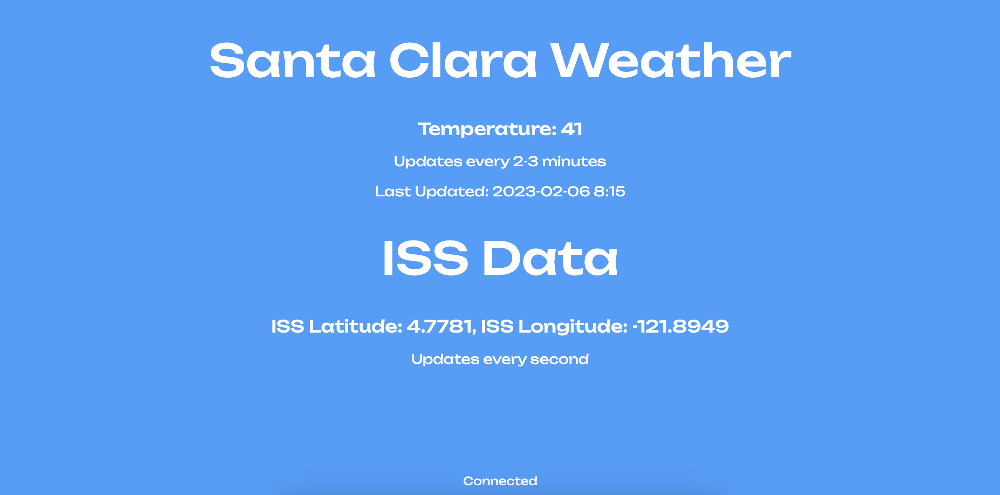

# WebSocket Weather and ISS Data Dashboard

This is a simple WebSocket-based dashboard that displays real-time weather and International Space Station (ISS) data for Santa Clara, California. The dashboard updates weather information every 2-3 minutes and ISS data every second.

## Prerequisites

Before running this application, make sure you have the following:

- Go programming language installed.
- API keys for [WeatherAPI](https://www.weatherapi.com/) and [Open Notify API](http://api.open-notify.org/) (Insert API keys in the code where specified).
- Internet access to fetch data from external APIs.

## Installation

1. Clone this repository:

   ```bash
   git clone https://github.com/yourusername/your-repo.git
   cd your-repo
   
2. Build and run the Go application:

   ```bash
   go build
   ./your-repo
   
3. Open your web browser and go to http://localhost:8080 to access the dashboard.

## Usage

- The dashboard displays the current weather in Santa Clara, California, and the ISS's latitude and longitude.
- Weather data updates every 2-3 minutes.
- ISS data updates every second.

## API Keys

Make sure to insert your API keys for WeatherAPI and Open Notify API in the `getWeatherData` function:

```go
key := "Insert API key here"

## WebSocket Client

A WebSocket client is included in the HTML file (`index.html`) provided in the code. It establishes a connection to the WebSocket server running on `ws://localhost:8080/ws`.

```html
<script>
  let socket = new WebSocket("ws://localhost:8080/ws");
  document.getElementById("footer").innerHTML = "Attempting Connection";

  socket.onopen = () => {
    document.getElementById("footer").innerHTML = "Connected";
  };

  socket.onclose = (event) => {
    document.getElementById("footer").innerHTML =
      "Disconnected from Server";
  };

  socket.onerror = (error) => {
    document.getElementById("footer").innerHTML = "Socket Error: " + error;
  };

  socket.onmessage = function (event) {
    let response = event.data;
    const data = JSON.parse(response);
    const weather = data.Weather;
    const updated = data.Updated;
    const iss = data.ISS;
    document.getElementById("weather").innerHTML = weather;
    document.getElementById("lastupdated").innerHTML =
      "Last Updated:" + updated;
    document.getElementById("iss").innerHTML = iss;
  };
</script>

## Screenshot




